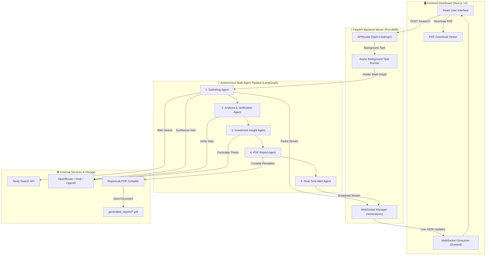

<<<<<<< HEAD
# 🚀 AI Startup Intelligence Platform

[](https://python.org)
[](https://fastapi.tiangolo.com)
[](https://nextjs.org)
[](https://langchain.com)
[](https://tailwindcss.com)
[](https://www.docker.com)

> An autonomous, multi-agent intelligence platform that conducts deep-web research, verifies cross-source data, predicts growth trajectories, formulates investment theses, and generates pixel-perfect PDF executive intelligence reports in real-time.

---

## 🌟 Key Features

| Feature Area | Capabilities & Description | Technical Implementation |
| :--- | :--- | :--- |
| **🤖 Autonomous Multi-Agent Orchestration** | 5 specialized AI agents run sequentially in a managed state graph to research, verify, analyze, report, and alert. | **LangGraph StateGraph**, **LangChain**, **ThreadPoolExecutor** |
| **🔍 Unified Deep Web Gathering** | Crawls web sources for funding history, hiring velocity, executive news, and social sentiment. | **Tavily AI Search API**, **Firecrawl Web Scraper** |
| **⚡ Real-Time WebSocket Streaming** | Streams agent progress, intermediate findings, and final reports live to the frontend dashboard. | **FastAPI WebSockets**, **Zustand State Management** |
| **📊 Growth Trajectory Meter** | Predicts startup performance and renders custom visual trajectory indicators (Low / Moderate / High Growth). | **Regex Sentiment Analyzer**, **ReportLab Vector Graphics** |
| **📑 Executive PDF Report Generator** | Generates professional, publication-ready PDF reports with dynamic headers, custom tables, and zero overlap. | **ReportLab Platypus**, `NumberedCanvas`, **UTF-8 Sanitizer** |
| **⚡ Modern Next.js UI Dashboard** | Interactive dark-mode dashboard with dynamic metric grids, news feeds, and live search tracking. | **Next.js 14 (App Router)**, **Recharts**, **Lucide React** |

---

## 🏗️ System Architecture & Workflow

### High-Level System Architecture



---

## 🔄 Autonomous Multi-Agent Pipeline Flowchart


---

## 🤖 Multi-Agent Roster Breakdown

| Agent Name | Primary Responsibility | Key Inputs | Tools & Services | Primary Output Payload |
| :--- | :--- | :--- | :--- | :--- |
| **🔍 Gathering Agent** | Unified deep-web search and multi-perspective data extraction. | `startup_name` | Tavily Search, Firecrawl Scraper, LLM | `research_data`, `funding_data`, `hiring_data`, `news_data`, `social_data` |
| **🧠 Analysis Agent** | Cross-verifies metrics, detects data discrepancies, and computes growth trajectory. | Extracted raw data dicts | Regex Sentiment Matcher, LLM | `verification_status`, `growth_prediction`, `is_verified` |
| **💡 Investment Insight Agent** | Evaluates risk profiles and formulates BUY / HOLD / AVOID investment recommendations. | Verified analysis & growth metrics | LLM Reasoning Engine | `investment_insights` (`recommendation`, `risk_analysis`) |
| **📑 PDF Report Agent** | Compiles structured state data into an aligned, publication-ready PDF document. | Complete `AgentState` | `ReportService` (ReportLab Engine) | `generated_reports/{startup}_{timestamp}.pdf` |
| **🔔 Alert Agent** | Dispatches real-time completion signals and metrics to connected UI clients. | Generated PDF path & report summary | FastAPI WebSocket Broadcast | JSON WebSocket Event Payload |

---

## 📡 API Endpoint Reference

### REST API Endpoints

| Method | Endpoint | Description | Request Body / Query | Response Payload |
| :--- | :--- | :--- | :--- | :--- |
| `POST` | `/api/v1/startups/research` | Triggers background multi-agent research workflow. | `{"startup_name": "OpenAI"}` | `{"status": "success", "message": "Agents dispatched..."}` |
| `GET` | `/api/v1/startups/{startup_name}/report/pdf` | Downloads the latest generated PDF intelligence report. | URL Path Parameter | `FileResponse` (`application/pdf`) |
| `GET` | `/` | Root API health & welcome endpoint. | None | `{"message": "Welcome to AI Startup Intelligence..."}` |

### WebSocket Gateway

| Channel | Gateway URI | Direction | Payload Type | Description |
| :--- | :--- | :--- | :--- | :--- |
| **Live Analysis Stream** | `ws://localhost:8000/ws/analysis` | Server $\rightarrow$ Client | `JSON` | Real-time agent state broadcasts (`agent_start`, `agent_partial_result`, `analysis_complete`). |

---

## 📄 Executive PDF Report Features

The PDF reporting engine (`report_service.py`) is engineered using **ReportLab** with precision formatting:

| PDF Component | Architectural Enhancement | Visual Benefit |
| :--- | :--- | :--- |
| **Exact 504pt Grid Alignment** | Margins are set to `0.75 in` with all headers, tables, drawings, and cards locked to `504 pt` width. | 100% margin alignment with zero awkward whitespace gaps. |
| **Structured Table Cards** | Callout sections (Verification Status & Recommendation Box) are wrapped in single-cell `Table` flowables. | Eliminates background box overlap over section titles completely. |
| **Dynamic Growth Meter Graphic** | Rendered via ReportLab `Drawing` shapes, using regex word-boundary matching (`\bhigh\b` vs `\blow\b`). | Prevents false positives (e.g., `"highly competitive"` triggering green bar). |
| **Unicode Text Sanitization** | `clean_pdf_text()` pre-processor converts `₹` $\rightarrow$ `INR`, smart quotes $\rightarrow$ standard quotes, and removes invalid characters. | Eliminates black box (`■`) rendering artifacts in standard fonts. |
| **Dynamic Numbered Canvas** | Custom `NumberedCanvas` pass-through canvas calculates exact total pages dynamically. | Produces professional `"Page X of Y"` footers and running headers. |

---

## ⚙️ Environment Variables

Create a `.env` file in the project root directory:

| Variable Name | Purpose | Example / Default Value | Required? |
| :--- | :--- | :--- | :---: |
| `OPENROUTER_API_KEY` | LLM inference gateway for agent reasoning. | `sk-or-v1-...` | Yes |
| `TAVILY_API_KEY` | Deep-web research search engine API. | `tvly-...` | Yes |
| `GROK_API_KEY` | Optional alternative LLM provider API. | `xai-...` | Optional |
| `FIRECRAWL_API_KEY` | Web page scraping & parsing API key. | `fc-...` | Optional |
| `LANGCHAIN_TRACING_V2` | LangSmith observability tracing flag. | `true` | Optional |
| `LANGCHAIN_API_KEY` | LangSmith API key for telemetry. | `lsv2_pt_...` | Optional |

---

## 🛠️ Quick Start & Installation

### Option 1: Running Locally (Recommended)

#### Prerequisites
- **Python 3.11+**
- **Node.js 18+** & **npm**

#### 1. Clone & Setup Backend
```bash
# Navigate to backend directory
cd backend

# Create and activate virtual environment
python -m venv venv
.\venv\Scripts\activate      # Windows (PowerShell)
# source venv/bin/activate   # macOS / Linux

# Install backend dependencies
pip install -r requirements.txt

# Start FastAPI development server
python -m uvicorn main:app --host 127.0.0.1 --port 8000 --reload
```

#### 2. Setup Frontend
```bash
# Open a new terminal and navigate to frontend directory
cd frontend

# Install frontend dependencies
npm install

# Start Next.js development server
npm run dev
```

> 🌐 **Frontend Dashboard:** [http://localhost:3000](http://localhost:3000)  
> ⚡ **FastAPI Swagger API Docs:** [http://localhost:8000/docs](http://localhost:8000/docs)

---

### Option 2: Running via Docker Compose

Run the full platform stack (Backend, Frontend, Redis) in containerized mode:

```bash
# Build and launch containers
docker-compose up --build
```

---

## 📁 Repository Directory Structure

```files.txt
task 1/
├── backend/
│   ├── agents/              # LangGraph multi-agent nodes & workflow definition
│   │   ├── nodes.py         # Agent node functions (Gathering, Analysis, Insight, Report, Alert)
│   │   ├── state.py         # TypedDict AgentState schema
│   │   └── workflow.py      # StateGraph compilation & edge routing
│   ├── api/                 # FastAPI API routes & WebSocket handlers
│   │   └── api_v1/          # Endpoint routers (/research, /report/pdf, /ws/analysis)
│   ├── core/                # System configuration & scheduler
│   ├── generated_reports/   # Target output folder for PDF executive reports
│   ├── services/            # Core business logic services
│   │   ├── llm_service.py   # LangChain LLM instance setup
│   │   ├── report_service.py# ReportLab PDF compilation & graphics engine
│   │   ├── scrape_service.py# Firecrawl web scraping integration
│   │   └── search_service.py# Tavily search API integration
│   ├── main.py              # FastAPI application entrypoint
│   └── requirements.txt     # Python backend dependencies
├── frontend/
│   ├── src/
│   │   └── app/             # Next.js 14 App Router pages & UI components
│   ├── package.json         # Node.js frontend dependencies
│   └── tailwind.config.js   # TailwindCSS styling configuration
├── docker-compose.yml       # Docker container orchestration manifest
└── README.md                # Project documentation & architecture manual
```

---

## 🛡️ License

This project is open-source under the [MIT License](LICENSE).
=======
# AI-Startup-Intelligence-Platform
An autonomous platform for startup discovery, data verification, intelligence analysis, growth trajectory prediction, and executive PDF reporting.
>>>>>>> d72dadf8b71406d34f2eb2725ca67595dff6be2d
